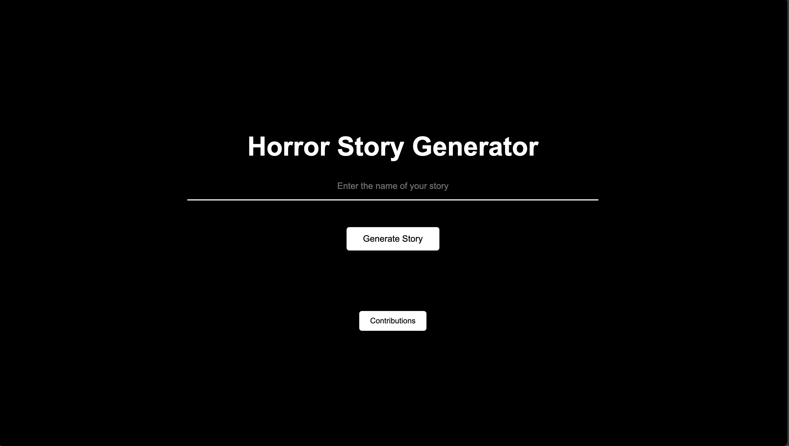

# The Horror Storytelling Project

## Motivation
This is just some idea that I thought of out of the blue while I was scrolling through shorts in Youtube. I realise with the current capabilities of AI nowadays, with some coding, we could literally make anything come into fruition. 

## What it does? 
This project allows user to create horror stories recounted by some of the most well-known voices like Mr. Nighmare, Llama art, completely with AI.



## Main Components 
- OpenAI API
- ElevenLabs API

## How to Clone and Set Up the Project
Clone the project from the GitHub repository:
   ```bash
   git clone https://github.com/Savoxism/The-Horror-Storytelling-Project.git